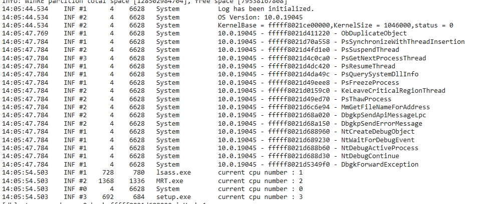
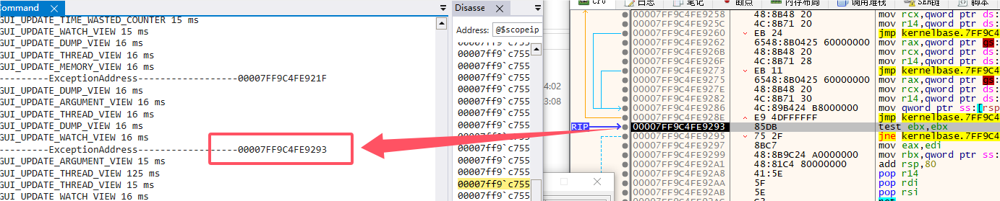
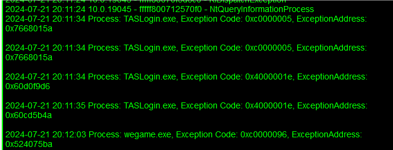

# ErisDbg

### 介绍

ErisDbg是一个基于vt的重建Windows10调试体系的项目。

基于VT的EPT HOOK，重构了Windows10的十余个关键的调试函数，已在Windows10 22H2实机测试。

VT部分参考： [HyperPlatform](https://github.com/tandasat/HyperPlatform)

### 重构的调试函数

- [x] NtCreateDebugObject

- [x] GetDbgkInitialize

- [x] NtWaitForDebugEvent

- [x] NtDebugActiveProcess

- [x] ProbeForReadSmallStructure

- [x] NtDebugContinue

- [x] DbgkpConvertKernelToUserStateChange

- [x] DbgkpOpenHandles

- [x] GePsGetProcessDebugPort

- [x] PsSetProcessDebugPort

- [x] IsThreadSkipCreationMsg

- [x] DbgkpSuspendProcess

- [x] DbgkpFreeDebugEvent

- [x] DbgkpWakeTarget

- [x] DbgkpQueueMessage

- [x] DbgkpSendApiMessage

- [x] DbgkpProcessToFileHandle

- [x] PsGetThreadToAPCProcess

- [x] DbgkSendSystemDllMessages

- [x] DbgkpPostFakeThreadMessages

- [x] DbgkpPostModuleMessages

- [x] DbgkpPostFakeProcessCreateMessages

- [x] DbgkpSetProcessDebugObject

- [x] PsCaptureExceptionPort

- [x] DbgkForwardException

